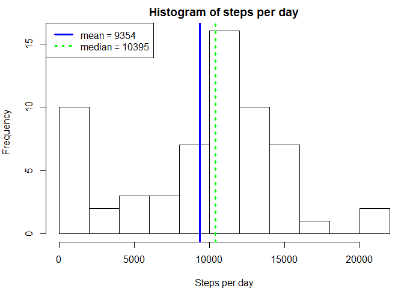
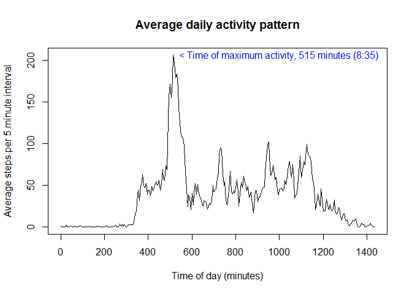
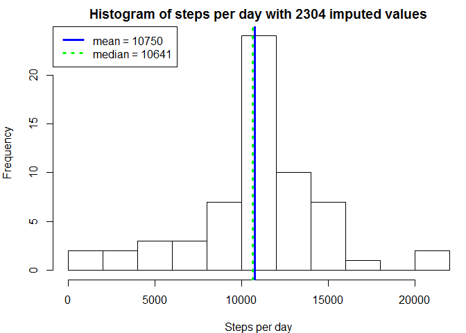
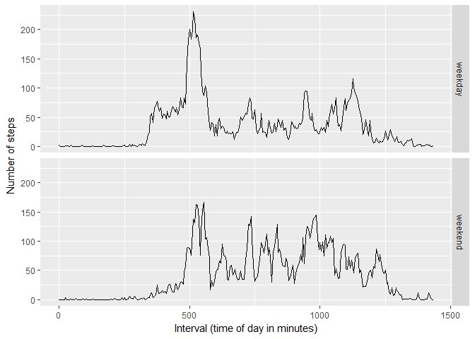

# Reproducible Research: Peer Assessment 1
D. Englert  
April 15, 2017  


```r
knitr::opts_chunk$set(echo = TRUE)

library(ggplot2)
```
## ## Loading and preprocessing the data


```r
activ.data <- read.csv("activity.csv")
# Reformat the dates
activ.data$date <- as.Date(activ.data$date)
# Calculate time of day from interval text
hrs <- substr(activ.data$interval, 1, nchar(activ.data$interval) - 2)
hrs[hrs == ""] <- 0
activ.data$time.of.day <-
    as.numeric(hrs) * 60 +
    as.numeric(substr(activ.data$interval,
                      nchar(activ.data$interval) - 1,
                      nchar(activ.data$interval)))
```
## What is mean total number of steps taken per day?


```r
# total number of steps taken per day
StepsPerDay <- 
    sapply(unique(activ.data$date),
           function(x) sum(activ.data[activ.data$date == x, "steps"],
                           na.rm = TRUE))
# mean and median values
mean.StepsPerDay <- round(mean(StepsPerDay), 0)
median.StepsPerDay <- median(StepsPerDay)

# histogram of the total number of steps that are taken each day
par(mar = c(4, 4, 2, 0.1))
hist(StepsPerDay, breaks = 10,
     xlab = "Steps per day",
     main = "Histogram of steps per day")
abline(v = mean.StepsPerDay, col = "blue", lty = "solid", lwd = 3)
abline(v = median.StepsPerDay, col = "green", lty = "dotted", lwd = 3)
legend(x = "topleft",
       legend = c(paste("mean =", mean.StepsPerDay),
                  paste("median =", median.StepsPerDay)),
       lty = c("solid", "dotted"), lwd = 3, col = c("blue", "green"))
```

<!-- -->

```r
print("  ")
```

```
## [1] "  "
```
## What is the average daily activity pattern?
  

```r
StepsPerInterv <- 
    sapply(unique(activ.data$time.of.day),
           function(x) mean(activ.data[activ.data$time.of.day == x, "steps"],
                           na.rm = TRUE))
# Plot the average steps per time interval
plot(unique(activ.data$time.of.day), StepsPerInterv,
     type = "l",
     xlab = "Time of day (minutes)",
     ylab = "Average steps per 5 minute interval",
     main = "Average daily activity pattern")
# print mean and median on the plot
time.max.act <-
    unique(activ.data$time.of.day)[StepsPerInterv == max(StepsPerInterv)]
hr.min.max.act <- paste(floor(time.max.act/60), time.max.act%%60, sep = ":")
max.steps <- StepsPerInterv[StepsPerInterv == max(StepsPerInterv)]
text(time.max.act, max.steps,
     pos = 4, col = "blue",
     paste("< Time of maximum activity, ",
           time.max.act, " minutes (", hr.min.max.act, ")", sep = ""))
```

<!-- -->

```r
print("  ")
```

```
## [1] "  "
```
## Imputing missing values


```r
# total number of missing values for steps
n.missing.val <- sum(is.na(activ.data$steps))
# mean values of steps across all time intervals
meanStepsPerInterv <- 
    floor(sapply(unique(activ.data$time.of.day),
           function(x) mean(activ.data[activ.data$time.of.day == x, "steps"],
                           na.rm = TRUE)))
names(meanStepsPerInterv) <- unique(activ.data$time.of.day)
# new column with steps NAs replaced with the mean of the corresponding
#   time interval
steps.NAs.i <- which(is.na(activ.data$steps)) # index of NAs
activ.data$steps.imputed <- activ.data$steps
activ.data$steps.imputed[steps.NAs.i] <-
    meanStepsPerInterv[as.character(activ.data$time.of.day[steps.NAs.i])]

# total number of steps taken per day with imputed values
StepsPerDay.imp <- 
    sapply(unique(activ.data$date),
           function(x) sum(activ.data[activ.data$date == x, "steps.imputed"],
                           na.rm = TRUE))
# mean and median values
mean.StepsPerDay.imp <- round(mean(StepsPerDay.imp), 0)
median.StepsPerDay.imp <- median(StepsPerDay.imp)

# histogram of the total number of steps taken each day with imputed values
par(mar = c(4, 4, 2, 0.1))
hist(StepsPerDay.imp, breaks = 10,
     xlab = "Steps per day",
     main = paste("Histogram of steps per day with",
                  n.missing.val, "imputed values"))
abline(v = mean.StepsPerDay.imp, col = "blue", lty = "solid", lwd = 3)
abline(v = median.StepsPerDay.imp, col = "green", lty = "dotted", lwd = 3)
legend(x = "topleft",
       legend = c(paste("mean =", mean.StepsPerDay.imp),
                  paste("median =", median.StepsPerDay.imp)),
       lty = c("solid", "dotted"), lwd = 3, col = c("blue", "green"))
```

<!-- -->

```r
print("  ")
```

```
## [1] "  "
```

```r
print("The disribution of the number of steps per day is more symmetrical (without a large number of steps per day at zero) when the missing values are imputed.")
```

```
## [1] "The disribution of the number of steps per day is more symmetrical (without a large number of steps per day at zero) when the missing values are imputed."
```
## Are there differences in activity patterns between weekdays and weekends?


```r
#  factor variable indicating whether a given date is a weekday or weekend day
weekends <- rep("weekday", nrow(activ.data))
weekends[weekdays(activ.data$date) == "Saturday" |
             weekdays(activ.data$date) == "Sunday"] <- "weekend"
activ.data$weekends <- as.factor(weekends)
# mean of steps per time interval for all days for weekdays and weekends
steps.weekends <-
    aggregate(steps.imputed ~ time.of.day + weekends, activ.data, mean)

# plot activity vs. time interval separately for weekday and weekends
g <- ggplot(data = steps.weekends,
            mapping = aes(time.of.day, steps.imputed))
p <- g + geom_line() +
    facet_grid(weekends~.) +
    xlab("Interval (time of day in minutes)") +
    ylab("Number of steps") 
print(p)
```

<!-- -->

```r
print("  ")
```

```
## [1] "  "
```


